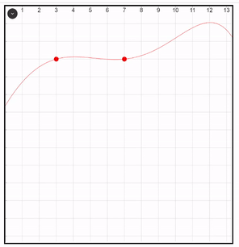

# react-graph-edit

[Try it out online](https://codesandbox.io/p/github/kvbc/react-graph-edit/main?file=%2FREADME.md&workspace=%257B%2522activeFileId%2522%253A%2522clf3yqxvt000lg2gld5468t20%2522%252C%2522openFiles%2522%253A%255B%2522%252FREADME.md%2522%255D%252C%2522sidebarPanel%2522%253A%2522EXPLORER%2522%252C%2522gitSidebarPanel%2522%253A%2522COMMIT%2522%252C%2522spaces%2522%253A%257B%2522clf3yqz7g000x356h155uug4j%2522%253A%257B%2522key%2522%253A%2522clf3yqz7g000x356h155uug4j%2522%252C%2522name%2522%253A%2522Default%2522%252C%2522devtools%2522%253A%255B%257B%2522key%2522%253A%2522clf3yqz7h000y356hd3eu4n3d%2522%252C%2522type%2522%253A%2522PROJECT_SETUP%2522%252C%2522isMinimized%2522%253Afalse%257D%252C%257B%2522type%2522%253A%2522PREVIEW%2522%252C%2522taskId%2522%253A%2522dev%2522%252C%2522port%2522%253A5173%252C%2522key%2522%253A%2522clf3yr4pq00aw356h8ghqkjbp%2522%252C%2522isMinimized%2522%253Afalse%257D%252C%257B%2522type%2522%253A%2522TASK_LOG%2522%252C%2522taskId%2522%253A%2522dev%2522%252C%2522key%2522%253A%2522clf3yr2tk006d356hsykibkxj%2522%252C%2522isMinimized%2522%253Afalse%257D%255D%257D%257D%252C%2522currentSpace%2522%253A%2522clf3yqz7g000x356h155uug4j%2522%252C%2522spacesOrder%2522%253A%255B%2522clf3yqz7g000x356h155uug4j%2522%255D%252C%2522hideCodeEditor%2522%253Afalse%257D)

# Technologies used:
- React
- TypeScript
- Sass
- Vite

# TODO
- Clean up the polynomial regression code
- Lerp zoom on camera (fix mouse wheel event handler)
- Make PointPosition use the correct Y sign
- Create a help menu
- Fix grid drawing order
- Improve drawing performance
- [?] Create a hook that acts as middleware for the useState() hook
